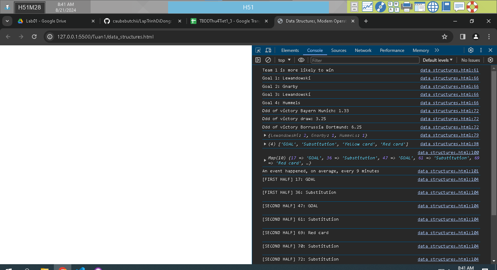
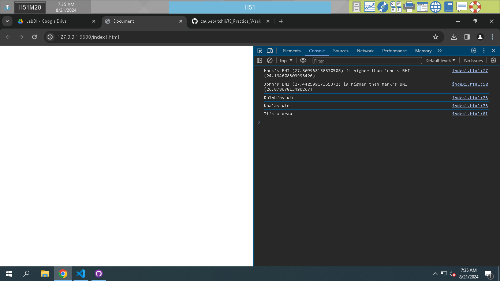
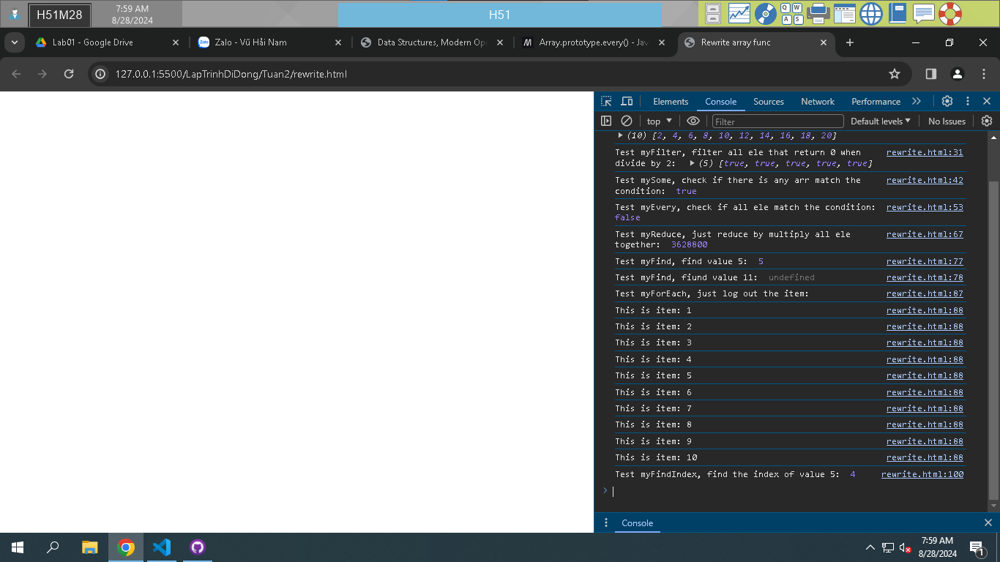
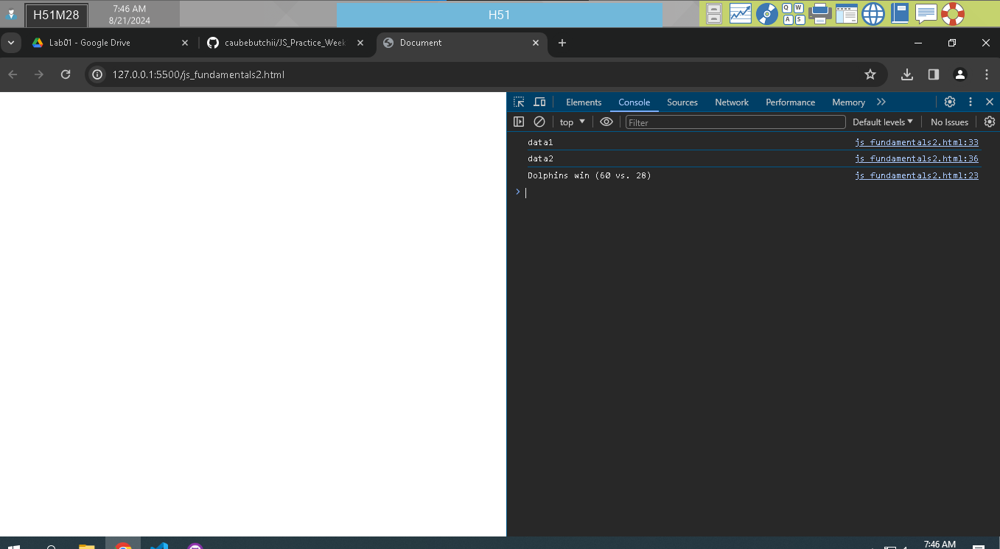
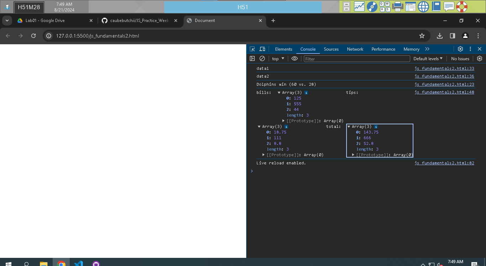
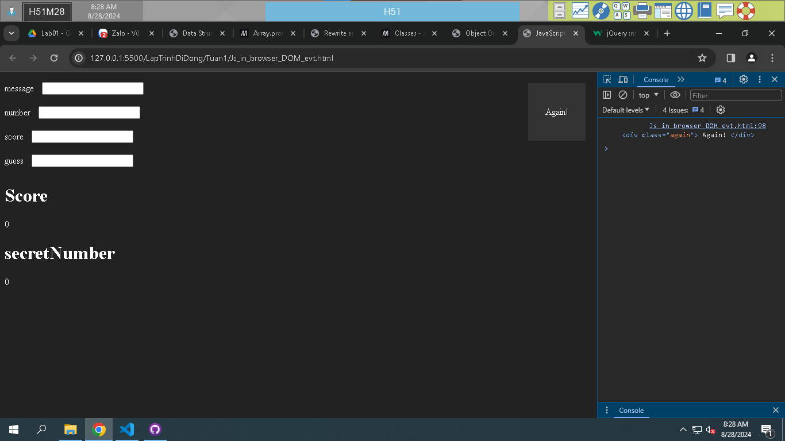
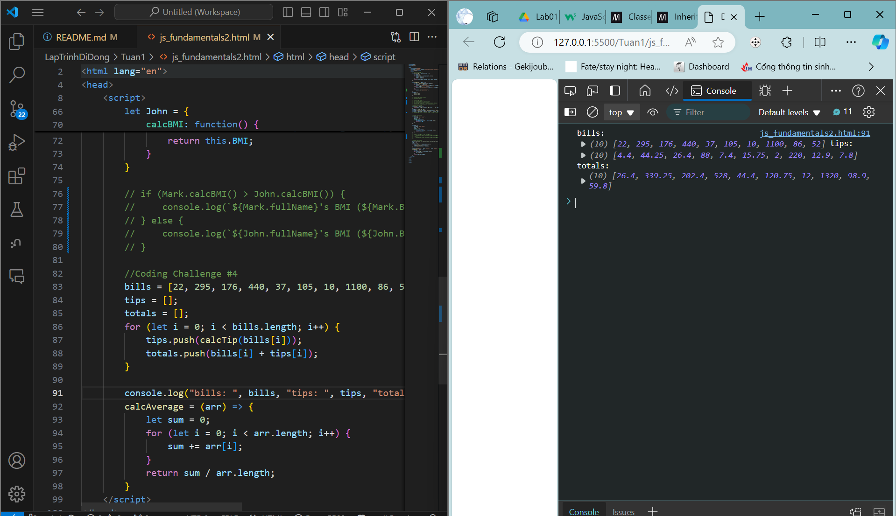
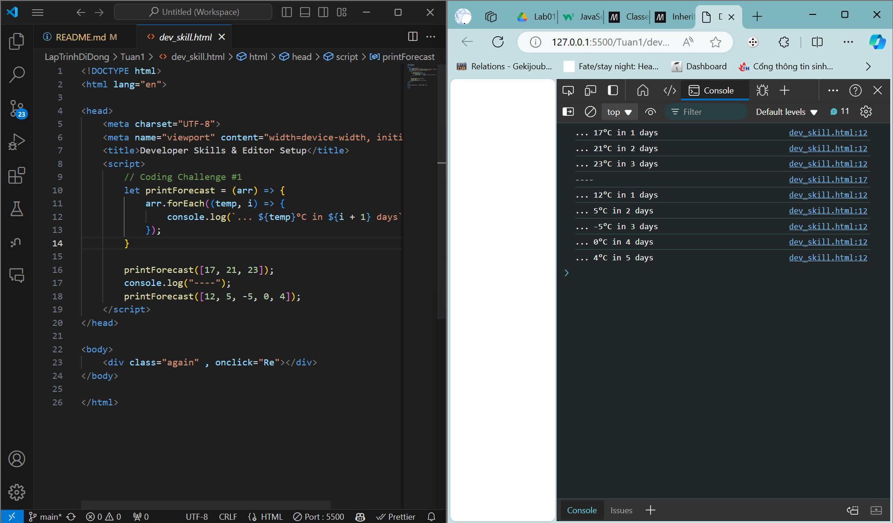

# JS_Practice_Week1
 Thuc hanh JS tuan 1
 JavaScript Fundamentals – Part 1
 Coding challenge 1:
 

 Coding challenge 2:
 

 Coding challenge 3:
 

 Conding challenge 4:
 

 JavaScript Fundamentals – Part 2

 Coding challenge 1:
 

 Coding challenge 2:
 

 Coding challenge 3:

 Coding challenge 4:
 

 Developer Skills & Editor Setup

 Coding challenge 1:

 JavaScript in the Browser: DOM and Events
 Coding challenge 1:

 Coding challenge 3:

 Coding challenge 4:
 