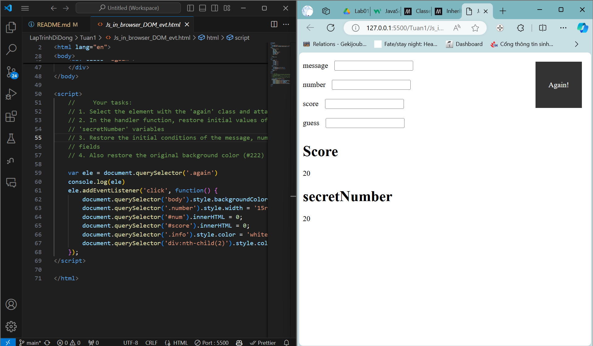
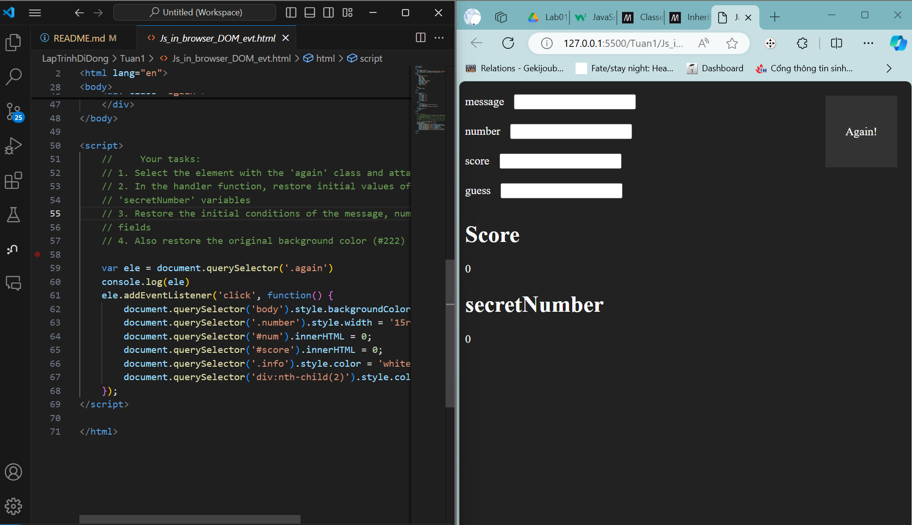
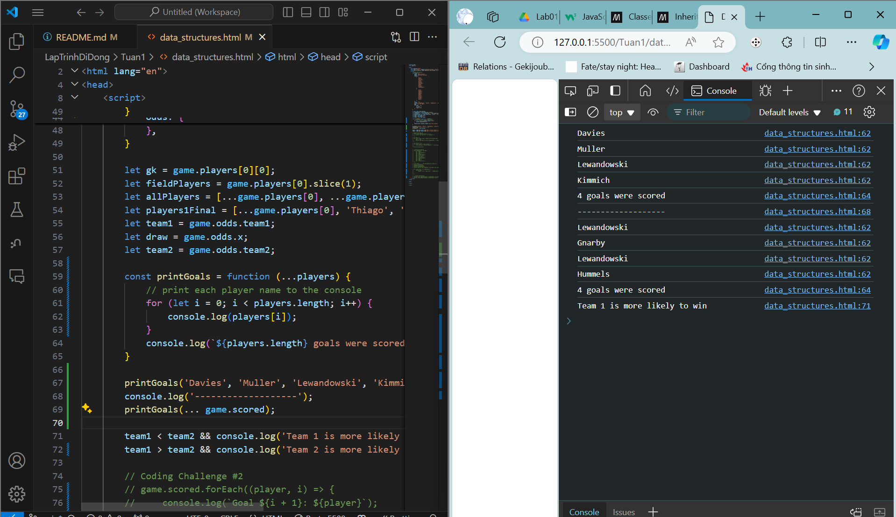
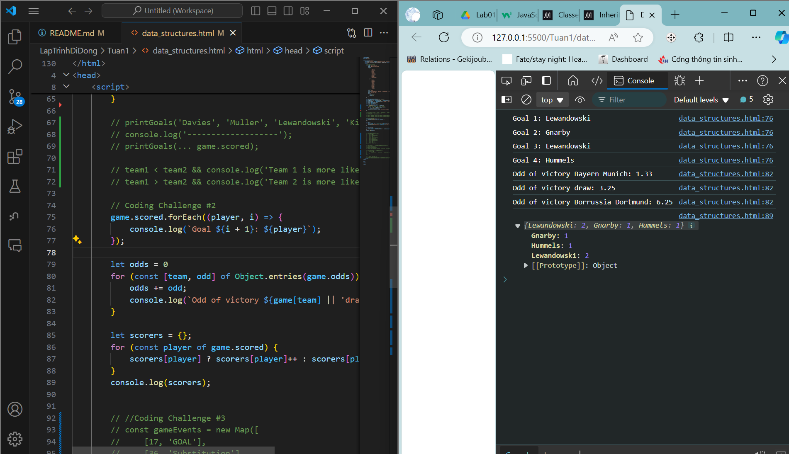
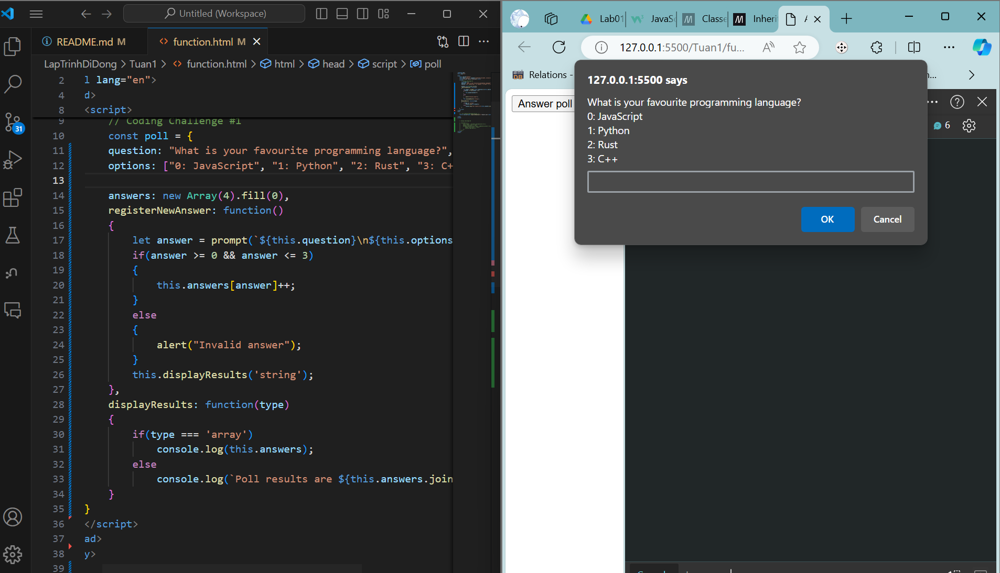
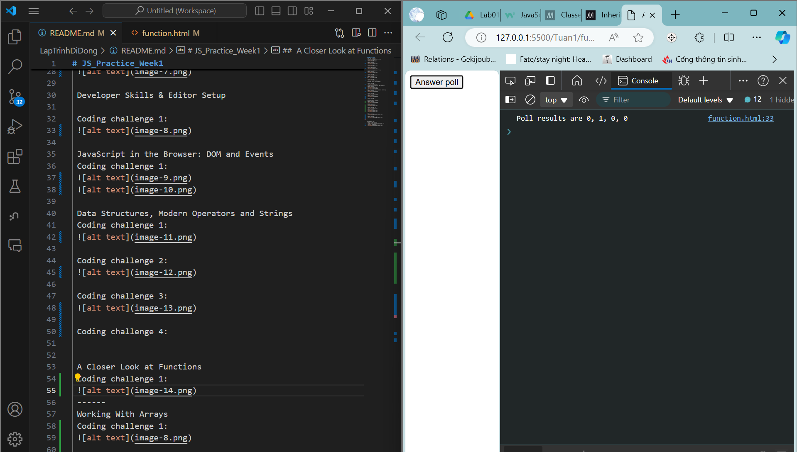
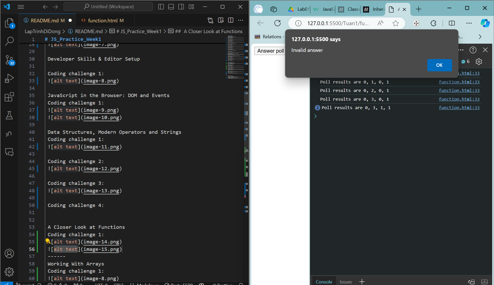
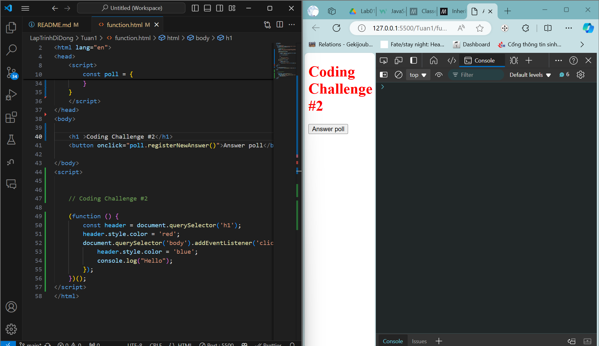
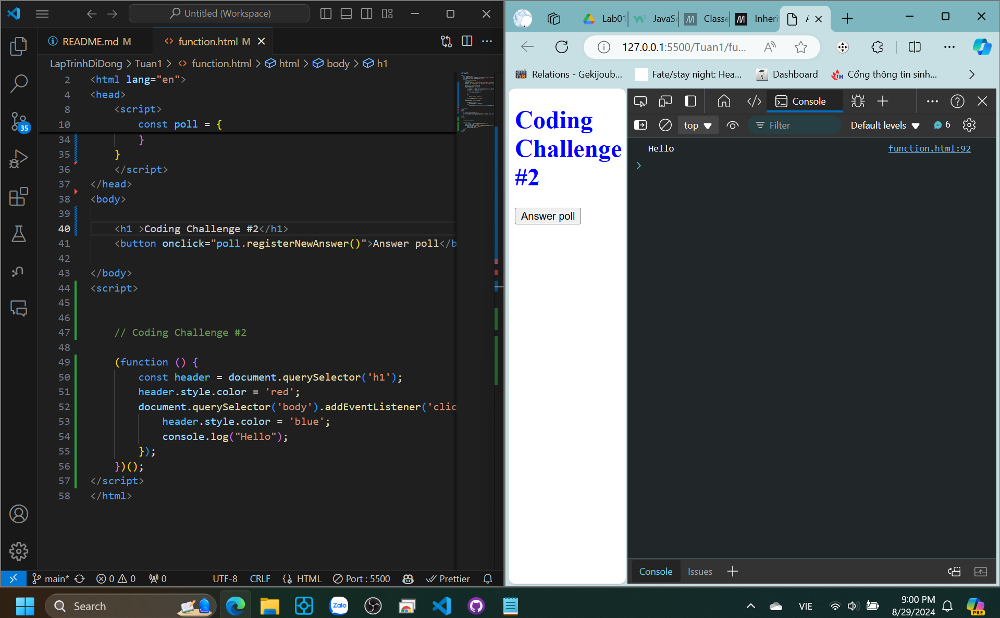

# JS_Practice_Week1
 Thuc hanh JS tuan 1
 JavaScript Fundamentals – Part 1
 Coding challenge 1:
 

 Coding challenge 2:
 

 Coding challenge 3:
 

 Conding challenge 4:
 

 JavaScript Fundamentals – Part 2

 Coding challenge 1:
 

 Coding challenge 2:
 

 Coding challenge 3:

 Coding challenge 4:
 

 Developer Skills & Editor Setup

 Coding challenge 1:
 

 JavaScript in the Browser: DOM and Events
 Coding challenge 1:
 
 

 Data Structures, Modern Operators and Strings
 Coding challenge 1:
 

 Coding challenge 2:
 

 Coding challenge 3:
 

 Coding challenge 4:

 A Closer Look at Functions
 Coding challenge 1:
 
 
 

 Coding challenge 2:
 
 
 ------
 Working With Arrays
 Coding challenge 1:
 

 Coding challenge 2,3:
 

 Coding challenge 4:
 
 

 OOP
 Coding challenge 1, 2:
 

 Coding challenge 3, 4:
 
 

 
 
Thuc hanh JS tuan 2
 Rewrite array functions
 - map, filter, some, every, reduce, find
 
 - forEach, findIndex
 